# ARM Architecture – Exam Ready Notes

---

## 🔹 1. Load/Store Architecture

### 📌 Definition

ARM follows a **Load/Store Architecture**, which means:

* Only **LDR (Load)** and **STR (Store)** instructions access memory
* All operations (ADD, SUB, etc.) are performed on **registers only**

---

### 📌 Key Rule

❌ Direct memory operation is NOT allowed

```
ADD mem, #5   (Invalid)
```

✅ Correct method:

```
LDR R1, [R2]
ADD R1, R1, #5
STR R1, [R2]
```

---

### 📌 Flow of Execution

Memory → Register → Operation → Register → Memory

---

### 📌 Key Points

* Registers are faster than memory
* Improves speed and efficiency
* Simplifies CPU design

---

## 🔹 2. ARM State vs Thumb State

### 📌 Definition

ARM processors operate in two states:

| State | Instruction Size | Feature          |
| ----- | ---------------- | ---------------- |
| ARM   | 32-bit           | High performance |
| Thumb | 16-bit           | Memory efficient |

---

### 📌 ARM State

* Uses full 32-bit instructions
* More powerful and flexible

---

### 📌 Thumb State

* Uses 16-bit compressed instructions
* Saves memory
* Slightly less powerful

---

### 📌 Switching Between States

* Done using branch instruction like:

```
BX R1
```

* Controlled by least significant bit of address

---

### 📌 Key Points

* ARM → Speed
* Thumb → Memory saving

---

## 🔹 3. Conditional Execution

### 📌 Definition

Conditional execution allows instructions to execute **only if a condition is true**

---

### 📌 Based on Flags

Uses flags from CPSR:

* Z (Zero)
* N (Negative)
* C (Carry)
* V (Overflow)

---

### 📌 Example

```
CMP R1, R2
ADDEQ R0, R0, #1
```

👉 ADD executes only if R1 == R2

---

### 📌 Common Conditions

| Condition | Meaning      |
| --------- | ------------ |
| EQ        | Equal (Z=1)  |
| NE        | Not Equal    |
| GT        | Greater Than |
| LT        | Less Than    |

---

### 📌 Advantage

* Reduces branching
* Improves performance
* Avoids pipeline breaks

---

### 📌 ARM vs Thumb

* ARM: Almost all instructions are conditional
* Thumb: Limited conditional execution (uses IT instruction)

---

## 🔹 Final Summary (Exam Point)

* ARM is a **Load/Store architecture**
* Memory is accessed only using **LDR/STR**
* Supports two states:

  * ARM (32-bit, fast)
  * Thumb (16-bit, compact)
* Supports **conditional execution** to reduce branching

---

# ARM Instruction Set – Complete Exam Answer (Detailed Notes)

---

## 🔹 1. Introduction

ARM (Advanced RISC Machine) is a **RISC-based processor architecture** widely used in embedded systems, mobile devices, and IoT.

### 📌 Key Characteristics:

* Uses **simple and fixed-length instructions**
* Focuses on **high performance and low power consumption**
* Based on **Load/Store architecture**

---

## 🔹 2. Features of ARM Instruction Set

### ✅ 1. RISC Architecture

* Simple instructions
* Faster execution
* Each instruction performs a small task

---

### ✅ 2. Load/Store Architecture

* Only **LDR** and **STR** access memory
* All operations are performed on registers

📌 Example:

```
LDR R1, [R2]
ADD R1, R1, #5
STR R1, [R2]
```

---

### ✅ 3. Large Register Set

* 16 registers (R0–R15)

| Register | Purpose              |
| -------- | -------------------- |
| R0–R12   | General purpose      |
| R13      | Stack Pointer (SP)   |
| R14      | Link Register (LR)   |
| R15      | Program Counter (PC) |

---

### ✅ 4. Conditional Execution

* Most instructions can be executed conditionally
* Reduces branching

📌 Example:

```
ADDEQ R1, R2, R3
```

---

### ✅ 5. Pipelining Support

* Improves execution speed
* Multiple instructions processed simultaneously

---

## 🔹 3. Types of ARM Instructions

---

### 🔸 1. Data Processing Instructions

👉 Perform operations on registers

📌 Examples:

```
ADD R0, R1, R2
SUB R0, R1, R2
AND R0, R1, R2
ORR R0, R1, R2
MOV R1, #10
CMP R1, R2
```

📌 Key Point:

* No direct memory access

---

### 🔸 2. Load and Store Instructions

👉 Used to access memory

📌 Examples:

```
LDR R1, [R2]
STR R1, [R2]
```

📌 Key Point:

* Only way to access memory

---

### 🔸 3. Branch Instructions

👉 Used for control flow (loops, conditions, functions)

📌 Examples:

```
B label
BEQ label
BNE label
BL function
```

📌 Key Point:

* BL is used for function calls

---

## 🔹 4. Addressing Modes

👉 Define how operands are accessed

### 📌 Types:

* Immediate addressing → `#value`
* Register addressing → registers only
* Register indirect → `[R2]`
* Offset addressing → `[R2, #4]`
* Pre-indexed → `[R2, #4]!`
* Post-indexed → `[R2], #4`

---

## 🔹 5. Condition Flags (CPSR)

👉 Used for decision making

| Flag | Meaning  |
| ---- | -------- |
| Z    | Zero     |
| N    | Negative |
| C    | Carry    |
| V    | Overflow |

📌 Example:

```
CMP R1, R2
BEQ label
```

---

## 🔹 6. ARM and Thumb States

| State | Instruction Size | Feature          |
| ----- | ---------------- | ---------------- |
| ARM   | 32-bit           | High performance |
| Thumb | 16-bit           | Memory efficient |

📌 Switching:

```
BX R1
```

---

## 🔹 7. Memory Representation (Theory)

Memory is represented as:

```
mem<data_size>[address]
```

📌 Example:

```
mem32[1000] = 25
```

📌 Used only for explanation (not actual instructions)

---

## 🔹 8. Advantages of ARM Instruction Set

* High speed execution
* Low power consumption
* Efficient memory usage
* Simple instruction design

---

## 🔹 9. Conclusion

ARM instruction set is efficient, simple, and optimized for performance. Its load/store architecture, conditional execution, and multiple addressing modes make it suitable for modern embedded and mobile systems.

---

# Memory Representation in ARM – Detailed Notes

---

## 🔹 1. Basic Concept of Memory

Memory (RAM) is a collection of storage locations where each location has:

* A unique **address**
* A **value** stored at that address

👉 Think of memory like a table:

| Address | Value |
| ------- | ----- |
| 1000    | 10    |
| 1004    | 20    |
| 1008    | 30    |

---

## 🔹 2. Internal Representation (Theory Notation)

In textbooks and exams, memory is represented as:

```
mem<data_size>[address]
```

---

## 🔹 3. Meaning of Each Component

### ✅ mem

* Represents **memory (RAM)**

### ✅ data_size

* Size of data stored at that location

| Data Size | Meaning  | Bytes |
| --------- | -------- | ----- |
| 8         | Byte     | 1     |
| 16        | Halfword | 2     |
| 32        | Word     | 4     |

### ✅ address

* Location in memory

---

## 🔹 4. Examples

### Example 1

```
mem32[1000] = 25
```

👉 A 32-bit value 25 is stored at address 1000

---

### Example 2 (Array Representation)

```
mem32[1000] = 10
mem32[1004] = 20
mem32[1008] = 30
```

👉 Explanation:

* Each value takes 4 bytes (32-bit)
* Address increases by 4
* This is how arrays are stored in memory

---

## 🔹 5. Important: Memory is Byte Addressable

Even though we write mem32, memory is actually stored as **bytes (8 bits)**.

### Example:

```
mem32[1000] = 0x12345678
```

👉 Internally stored as:

| Address | Value (Hex) |
| ------- | ----------- |
| 1000    | 78          |
| 1001    | 56          |
| 1002    | 34          |
| 1003    | 12          |

👉 This is called **Little Endian format** (used in ARM)

---

## 🔹 6. How ARM Instructions Use Memory

### Instruction:

```
LDR R1, [R2]
```

### Internal Meaning:

```
R1 = mem32[R2]
```

---

### Instruction:

```
STR R1, [R2]
```

### Internal Meaning:

```
mem32[R2] = R1
```

---

## 🔹 7. Example with Pre and Post Conditions

### Pre-condition:

```
R2 = 1000
mem32[1000] = 50
```

### Instruction:

```
LDR R1, [R2]
```

### Post-condition:

```
R1 = 50
```

---

## 🔹 8. Key Points for Exam

* Memory is represented as mem<data_size>[address]
* This is **theoretical notation**, not actual instruction
* ARM memory is **byte addressable**
* Data sizes determine how addresses increase
* LDR reads from memory, STR writes to memory

---

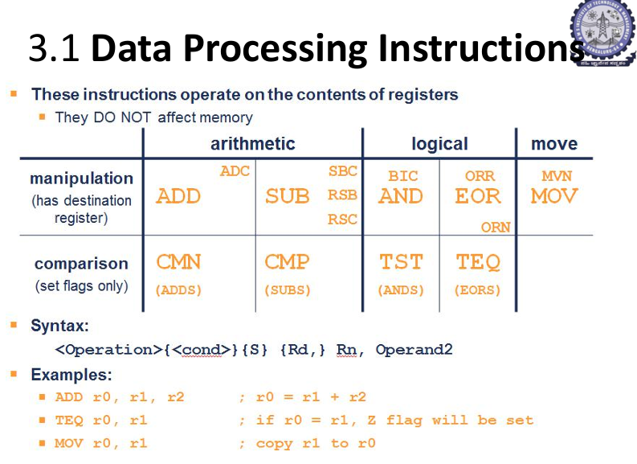

# Data Processing Instructions in ARM – Detailed Exam Notes

---

## 🔹 1. Introduction

Data processing instructions are one of the most important groups of instructions in the ARM instruction set.

These instructions are used to perform operations such as:

* Arithmetic operations
* Logical operations
* Data movement
* Comparison operations

---

## 🔹 2. Important Point

Data processing instructions operate on the contents of **registers**.

They **do not directly affect memory**.

This means ARM first loads data from memory into registers, performs the operation inside the CPU, and then stores the result back to memory if needed.

---

## 🔹 3. Why Data Processing Instructions Use Registers

ARM is a **Load/Store architecture**.

So:

* Memory can be accessed only using `LDR` and `STR`
* Arithmetic and logical operations are done only on registers

### Example:

```asm
LDR R1, [R2]      ; Load value from memory into R1
ADD R3, R1, #5    ; Process data in register
STR R3, [R2]      ; Store result back to memory
```

---

## 🔹 4. General Syntax of Data Processing Instructions

```asm
<operation>{<cond>}{S} Rd, Rn, Operand2
```

---

## 🔹 5. Meaning of Each Part

### ✅ operation

This is the instruction name.

Examples:

```asm
ADD, SUB, AND, ORR, MOV, CMP
```

---

### ✅ cond

This is the optional condition field.

It tells the processor to execute the instruction only if a condition is satisfied.

Examples:

```asm
EQ, NE, GT, LT
```

### Example:

```asm
ADDEQ R0, R1, R2
```

Meaning:

* Add only if equal condition is true

---

### ✅ S

The `S` suffix is optional.

If `S` is used, the instruction updates condition flags in CPSR.

### Example:

```asm
ADDS R0, R1, R2
```

Meaning:

* R0 = R1 + R2
* Flags are also updated

---

### ✅ Rd

`Rd` means destination register.

It stores the final result.

### Example:

```asm
ADD R0, R1, R2
```

Here:

* R0 is destination register

---

### ✅ Rn

`Rn` is the first source register.

### Example:

```asm
ADD R0, R1, R2
```

Here:

* R1 is first operand/source register

---

### ✅ Operand2

Operand2 is the second operand.

It can be:

* Register
* Immediate value
* Shifted register

### Examples:

```asm
ADD R0, R1, R2      ; Operand2 is register
ADD R0, R1, #5      ; Operand2 is immediate value
ADD R0, R1, R2, LSL #1  ; Operand2 is shifted register
```

---

# 🔹 6. Classification of Data Processing Instructions

Data processing instructions are mainly classified into two types:

1. Manipulation instructions
2. Comparison instructions

---

# 🔸 A. Manipulation Instructions

Manipulation instructions perform actual operations and store the result in a destination register.

They have a destination register `Rd`.

### General form:

```asm
Instruction Rd, Rn, Operand2
```

---

## 1. Arithmetic Instructions

Arithmetic instructions perform mathematical operations.

---

### ✅ ADD – Addition

```asm
ADD R0, R1, R2
```

Meaning:

```asm
R0 = R1 + R2
```

Example:
If:

```asm
R1 = 5
R2 = 3
```

Then:

```asm
R0 = 8
```

---

### ✅ ADC – Add with Carry

```asm
ADC R0, R1, R2
```

Meaning:

```asm
R0 = R1 + R2 + Carry
```

It is used when adding large numbers that require carry from previous addition.

---

### ✅ SUB – Subtraction

```asm
SUB R0, R1, R2
```

Meaning:

```asm
R0 = R1 - R2
```

Example:
If:

```asm
R1 = 10
R2 = 4
```

Then:

```asm
R0 = 6
```

---

### ✅ SBC – Subtract with Carry

```asm
SBC R0, R1, R2
```

Meaning:

```asm
R0 = R1 - R2 - NOT Carry
```

It is mainly used in multi-word subtraction.

---

### ✅ RSB – Reverse Subtract

```asm
RSB R0, R1, R2
```

Meaning:

```asm
R0 = R2 - R1
```

This is different from SUB.

### Difference:

```asm
SUB R0, R1, R2   ; R0 = R1 - R2
RSB R0, R1, R2   ; R0 = R2 - R1
```

---

### ✅ RSC – Reverse Subtract with Carry

```asm
RSC R0, R1, R2
```

Meaning:

```asm
R0 = R2 - R1 - NOT Carry
```

It is used for reverse subtraction involving carry/borrow.

---

## 2. Logical Instructions

Logical instructions perform bitwise operations.

They work on individual bits of the operands.

---

### ✅ AND – Bitwise AND

```asm
AND R0, R1, R2
```

Meaning:

```asm
R0 = R1 AND R2
```

### Example:

```asm
R1 = 0101
R2 = 0011
```

Result:

```asm
R0 = 0001
```

Rule:

* 1 AND 1 = 1
* Otherwise = 0

---

### ✅ ORR – Bitwise OR

```asm
ORR R0, R1, R2
```

Meaning:

```asm
R0 = R1 OR R2
```

### Example:

```asm
R1 = 0101
R2 = 0011
```

Result:

```asm
R0 = 0111
```

Rule:

* If any one bit is 1, result is 1

---

### ✅ EOR – Exclusive OR

```asm
EOR R0, R1, R2
```

Meaning:

```asm
R0 = R1 XOR R2
```

### Example:

```asm
R1 = 0101
R2 = 0011
```

Result:

```asm
R0 = 0110
```

Rule:

* Same bits → 0
* Different bits → 1

---

### ✅ BIC – Bit Clear

```asm
BIC R0, R1, R2
```

Meaning:

```asm
R0 = R1 AND NOT R2
```

It clears selected bits.

### Example:

```asm
R1 = 1111
R2 = 0101
```

NOT R2:

```asm
1010
```

Result:

```asm
R0 = 1111 AND 1010 = 1010
```

---

### ✅ ORN – OR NOT

```asm
ORN R0, R1, R2
```

Meaning:

```asm
R0 = R1 OR NOT R2
```

It performs OR operation with the inverted value of Operand2.

---

## 3. Move Instructions

Move instructions are used to copy or move values into registers.

---

### ✅ MOV – Move

```asm
MOV R0, R1
```

Meaning:

```asm
R0 = R1
```

It copies the value of R1 into R0.

### Example:

```asm
MOV R0, #10
```

Meaning:

```asm
R0 = 10
```

---

### ✅ MVN – Move NOT

```asm
MVN R0, R1
```

Meaning:

```asm
R0 = NOT R1
```

It stores the bitwise complement of R1 into R0.

### Example:

If:

```asm
R1 = 00001111
```

Then:

```asm
R0 = 11110000
```

---

# 🔸 B. Comparison Instructions

Comparison instructions do not store a result in a destination register.

They only update the condition flags in CPSR.

They are mainly used before conditional branch instructions.

---

## Important Point

Comparison instructions are similar to normal data processing instructions with `S`, but they do not store the result.

Example:

```asm
CMP R0, R1
```

It performs:

```asm
R0 - R1
```

But it does not store the result. It only updates flags.

---

## 1. CMP – Compare

```asm
CMP R0, R1
```

Meaning:

```asm
R0 - R1
```

Flags are updated based on the result.

### Example:

```asm
CMP R0, R1
BEQ LABEL
```

If R0 equals R1, Z flag is set and branch occurs.

---

## 2. CMN – Compare Negative

```asm
CMN R0, R1
```

Meaning:

```asm
R0 + R1
```

It updates flags based on addition result.

It is similar to:

```asm
ADDS R0, R0, R1
```

But result is not stored.

---

## 3. TST – Test

```asm
TST R0, R1
```

Meaning:

```asm
R0 AND R1
```

It updates flags based on AND result.

It is commonly used to check whether particular bits are set or clear.

### Example:

```asm
TST R0, #1
```

Meaning:

* Checks whether the least significant bit of R0 is 1 or 0

---

## 4. TEQ – Test Equivalence

```asm
TEQ R0, R1
```

Meaning:

```asm
R0 XOR R1
```

It updates flags based on XOR result.

If R0 and R1 are equal, XOR result becomes 0, so Z flag is set.

---

# 🔹 7. Condition Flags Used

Data processing instructions can update flags if `S` is used.

The four main flags are:

| Flag | Meaning       |
| ---- | ------------- |
| N    | Negative flag |
| Z    | Zero flag     |
| C    | Carry flag    |
| V    | Overflow flag |

---

## Examples:

```asm
ADDS R0, R1, R2
```

Updates flags after addition.

```asm
SUBS R0, R1, R2
```

Updates flags after subtraction.

```asm
CMP R0, R1
```

Always updates flags, but does not store result.

---

# 🔹 8. Examples from Slide

---

## Example 1: ADD

```asm
ADD R0, R1, R2
```

Meaning:

```asm
R0 = R1 + R2
```

If:

```asm
R1 = 5
R2 = 6
```

Then:

```asm
R0 = 11
```

---

## Example 2: TEQ

```asm
TEQ R0, R1
```

Meaning:

```asm
R0 XOR R1
```

If R0 equals R1:

```asm
R0 XOR R1 = 0
```

So:

```asm
Z flag = 1
```

---

## Example 3: MOV

```asm
MOV R0, R1
```

Meaning:

```asm
R0 = R1
```

It copies the contents of R1 into R0.

---

# 🔹 9. Difference Between Manipulation and Comparison Instructions

| Manipulation Instructions                   | Comparison Instructions     |
| ------------------------------------------- | --------------------------- |
| Store result in destination register        | Do not store result         |
| Used for arithmetic/logical/move operations | Used only to set flags      |
| Example: ADD, SUB, AND, MOV                 | Example: CMP, CMN, TST, TEQ |

---

# 🔹 10. Exam-Ready Summary

Data processing instructions in ARM are used to perform arithmetic, logical, move, and comparison operations on register contents. These instructions do not directly access memory. Manipulation instructions store the result in a destination register, while comparison instructions only update the condition flags. The general syntax is `<operation>{cond}{S} Rd, Rn, Operand2`. Examples include ADD, SUB, AND, ORR, MOV, CMP, TST, and TEQ.

---
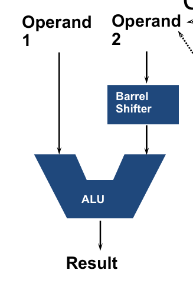
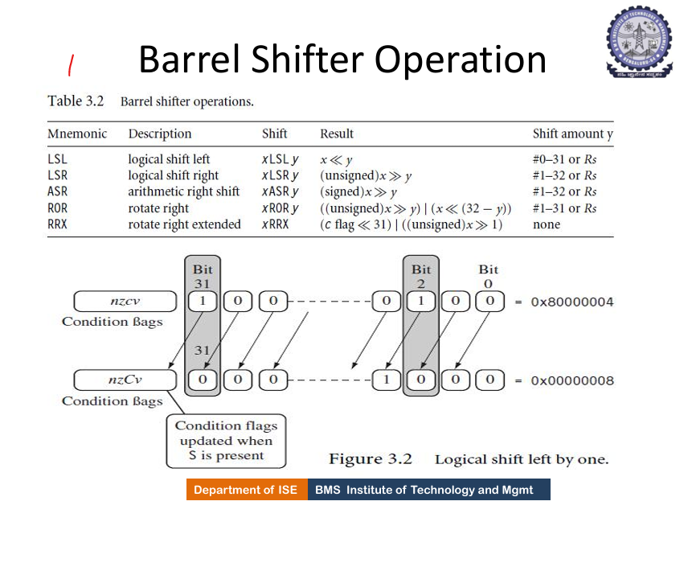
# Barrel Shifter in ARM – Detailed Exam Notes

---

## 🔹 1. Introduction

A **barrel shifter** is a special hardware unit present inside the ARM processor.

It is used to **shift or rotate bits** of a register value before the value is given to the ALU (Arithmetic Logic Unit).

In ARM data processing instructions, the **second operand (Operand2)** can be shifted or rotated using the barrel shifter.

---

## 🔹 2. Why Barrel Shifter is Important in ARM

ARM data processing instructions usually use two operands:

```asm
ADD R0, R1, R2
```

Meaning:

```asm
R0 = R1 + R2
```

Here:

* `R1` is Operand1
* `R2` is Operand2
* ALU performs addition

But in ARM, Operand2 can be modified before reaching the ALU.

Example:

```asm
ADD R0, R1, R2, LSL #2
```

Meaning:

```asm
R0 = R1 + (R2 << 2)
```

So `R2` is first shifted left by 2 bits and then added to `R1`.

This is done by the **barrel shifter**.

---

## 🔹 3. Flow of Operation

The flow is:

```text
Operand1  ---------------------> ALU

Operand2 ---> Barrel Shifter ---> ALU

ALU ---------------------------> Result
```

So:

* Operand1 goes directly to ALU
* Operand2 first goes through barrel shifter
* Shifted/rotated Operand2 is then used by ALU

---

## 🔹 4. Main Advantage

The main advantage of barrel shifter is that ARM can perform:

```text
Shift operation + arithmetic/logical operation
```

in a **single instruction**.

Without barrel shifter:

```asm
MOV R3, R2, LSL #2
ADD R0, R1, R3
```

With barrel shifter:

```asm
ADD R0, R1, R2, LSL #2
```

Thus, barrel shifter:

* Reduces number of instructions
* Improves speed
* Makes code compact
* Helps in multiplication/division by powers of 2

---

## 🔹 5. General Syntax

```asm
<Instruction> Rd, Rn, Rm, <shift_type> #shift_amount
```

Example:

```asm
ADD R0, R1, R2, LSL #2
```

Meaning:

```asm
R0 = R1 + (R2 shifted left by 2)
```

Where:

| Part     | Meaning                           |
| -------- | --------------------------------- |
| `ADD`    | Operation                         |
| `R0`     | Destination register              |
| `R1`     | First operand register            |
| `R2`     | Second operand register           |
| `LSL #2` | Shift operation on second operand |

---

## 🔹 6. Operand2 in ARM

In ARM data processing instructions, Operand2 can be:

1. Immediate value
2. Register value
3. Register value with shift

---

### ✅ 1. Immediate Value

```asm
ADD R0, R1, #5
```

Meaning:

```asm
R0 = R1 + 5
```

Here Operand2 is a constant value.

---

### ✅ 2. Register Value

```asm
ADD R0, R1, R2
```

Meaning:

```asm
R0 = R1 + R2
```

Here Operand2 is register `R2`.

---

### ✅ 3. Register with Shift

```asm
ADD R0, R1, R2, LSL #1
```

Meaning:

```asm
R0 = R1 + (R2 << 1)
```

Here Operand2 is `R2` shifted left by 1.

---

## 🔹 7. Shift Amount

The shift amount tells how many bit positions should be shifted or rotated.

It can be specified in two ways:

---

### 🔸 A. Shift by Immediate Value

```asm
ADD R0, R1, R2, LSL #2
```

Here:

* Shift amount is `#2`
* It is fixed inside instruction

Meaning:

```asm
R0 = R1 + (R2 << 2)
```

---

### 🔸 B. Shift by Register Value

```asm
ADD R0, R1, R2, LSL R3
```

Here:

* Shift amount is stored in register `R3`

If:

```asm
R3 = 2
```

Then:

```asm
R0 = R1 + (R2 << 2)
```

---

## 🔹 8. Types of Barrel Shifter Operations

ARM supports the following shift and rotate operations:

1. LSL – Logical Shift Left
2. LSR – Logical Shift Right
3. ASR – Arithmetic Shift Right
4. ROR – Rotate Right
5. RRX – Rotate Right Extended

---

# 🔸 8.1 LSL – Logical Shift Left

## 📌 Meaning

`LSL` shifts all bits to the **left**.

Zeros are filled on the right side.

---

## 📌 Syntax

```asm
Rm, LSL #n
```

---

## 📌 Example

```text
00000101  = 5
```

After:

```asm
LSL #1
```

Result:

```text
00001010  = 10
```

So:

```text
5 LSL #1 = 10
```

---

## 📌 Use

Logical Shift Left is used for multiplication by powers of 2.

```text
LSL #1  = multiply by 2
LSL #2  = multiply by 4
LSL #3  = multiply by 8
```

---

## 📌 ARM Example

```asm
ADD R0, R1, R2, LSL #2
```

Meaning:

```asm
R0 = R1 + (R2 × 4)
```

If:

```asm
R1 = 10
R2 = 3
```

Then:

```asm
R0 = 10 + (3 × 4)
R0 = 22
```

---

# 🔸 8.2 LSR – Logical Shift Right

## 📌 Meaning

`LSR` shifts all bits to the **right**.

Zeros are filled on the left side.

---

## 📌 Syntax

```asm
Rm, LSR #n
```

---

## 📌 Example

```text
00001000 = 8
```

After:

```asm
LSR #1
```

Result:

```text
00000100 = 4
```

So:

```text
8 LSR #1 = 4
```

---

## 📌 Use

Logical Shift Right is used for division by powers of 2 for **unsigned numbers**.

```text
LSR #1 = divide by 2
LSR #2 = divide by 4
LSR #3 = divide by 8
```

---

# 🔸 8.3 ASR – Arithmetic Shift Right

## 📌 Meaning

`ASR` shifts bits to the **right**, but it preserves the sign bit.

It is used for **signed numbers**.

---

## 📌 Why ASR is Needed

In signed numbers:

* MSB = 0 means positive
* MSB = 1 means negative

If we use normal logical shift right on negative numbers, the sign may change.

So ASR copies the MSB while shifting.

---

## 📌 Example for Positive Number

```text
00001000 = +8
```

After:

```asm
ASR #1
```

Result:

```text
00000100 = +4
```

---

## 📌 Example for Negative Number

```text
10001000
```

After:

```asm
ASR #1
```

Result:

```text
11000100
```

Notice:

* Left side is filled with `1`
* Sign remains negative

---

## 📌 Difference Between LSR and ASR

| LSR                       | ASR                     |
| ------------------------- | ----------------------- |
| Logical shift right       | Arithmetic shift right  |
| Fills 0 on left           | Fills sign bit on left  |
| Used for unsigned numbers | Used for signed numbers |

---

# 🔸 8.4 ROR – Rotate Right

## 📌 Meaning

`ROR` rotates bits to the right.

The bits that go out from the right side come back from the left side.

---

## 📌 Syntax

```asm
Rm, ROR #n
```

---

## 📌 Example

```text
10000001
```

After:

```asm
ROR #1
```

Result:

```text
11000000
```

Explanation:

* Rightmost bit `1` goes out
* It re-enters at the leftmost position

---

# 🔸 8.5 RRX – Rotate Right Extended

## 📌 Meaning

`RRX` means **Rotate Right Extended**.

It rotates right by one bit using the **Carry flag**.

---

## 📌 How it Works

```text
Carry → Bit31 → Bit30 → ... → Bit1 → Bit0 → Carry
```

So:

* Old Carry becomes new Bit31
* Old Bit0 becomes new Carry

---

## 📌 Syntax

```asm
Rm, RRX
```

---

## 📌 Example Concept

Before:

```text
Carry = 1
Rm = 00000010
```

After RRX:

```text
New MSB = 1
Old bit0 goes into Carry
```

RRX is mainly used in multi-word arithmetic and bit manipulation.

---

## 🔹 9. Carry Flag and Barrel Shifter

When a shift operation is performed, the bit that is shifted out may be placed into the **Carry flag**.

But flags are updated only when the instruction uses the `S` suffix.

---

## 📌 Example

```asm
MOVS R0, R1, LSL #1
```

Here:

* `R1` is shifted left by 1
* Result is stored in `R0`
* Flags are updated because `S` is used

---

## 📌 Example with Hex Value

```asm
R1 = 0x80000004
MOVS R0, R1, LSL #1
```

Binary idea:

* Bit 31 is `1`
* When shifted left, that bit goes out
* Carry flag becomes `1`

Result:

```asm
R0 = 0x00000008
C flag = 1
```

This is the idea shown in the slide.

---

## 🔹 10. Immediate Constants and Barrel Shifter

ARM immediate values have a special encoding.

An immediate value in ARM data processing instruction is commonly represented using:

```text
8-bit immediate value rotated right by an even number of positions
```

This allows ARM to represent more 32-bit constants than just 0 to 255.

---

## 📌 Example

A small 8-bit value can be rotated to produce a larger 32-bit constant.

This is useful because ARM instructions are fixed size, so there is limited space inside instruction encoding.

---

## 🔹 11. Barrel Shifter with Different Instructions

The barrel shifter can be used with many data processing instructions.

---

## 📌 Example 1: ADD with Shift

```asm
ADD R0, R1, R2, LSL #2
```

Meaning:

```asm
R0 = R1 + (R2 × 4)
```

---

## 📌 Example 2: SUB with Shift

```asm
SUB R0, R1, R2, LSR #1
```

Meaning:

```asm
R0 = R1 - (R2 / 2)
```

---

## 📌 Example 3: AND with Shift

```asm
AND R0, R1, R2, LSR #1
```

Meaning:

```asm
R0 = R1 AND (R2 >> 1)
```

---

## 📌 Example 4: MOV with Shift

```asm
MOV R0, R1, LSL #3
```

Meaning:

```asm
R0 = R1 × 8
```

---

## 🔹 12. Table of Barrel Shifter Operations

| Operation | Full Form              | Meaning                         |
| --------- | ---------------------- | ------------------------------- |
| LSL       | Logical Shift Left     | Shift left, fill zeros on right |
| LSR       | Logical Shift Right    | Shift right, fill zeros on left |
| ASR       | Arithmetic Shift Right | Shift right, preserve sign bit  |
| ROR       | Rotate Right           | Rotate bits right               |
| RRX       | Rotate Right Extended  | Rotate right through Carry flag |

---

## 🔹 13. Difference Between Shift and Rotate

| Shift                            | Rotate                                    |
| -------------------------------- | ----------------------------------------- |
| Bits shifted out are lost        | Bits shifted out re-enter from other side |
| Example: LSL, LSR, ASR           | Example: ROR, RRX                         |
| Used for multiplication/division | Used for bit manipulation                 |

---

## 🔹 14. Difference Between Immediate Shift and Register Shift

| Immediate Shift       | Register Shift                     |
| --------------------- | ---------------------------------- |
| Shift amount is fixed | Shift amount is stored in register |
| Example: `LSL #2`     | Example: `LSL R3`                  |
| Faster and simpler    | More flexible                      |

---

## 🔹 15. Why Barrel Shifter is Powerful

The barrel shifter is powerful because it allows complex operations to be done in one instruction.

Example:

```asm
ADD R0, R1, R2, LSL #2
```

This single instruction does:

```text
1. Shift R2 left by 2
2. Add shifted value to R1
3. Store result in R0
```

Without barrel shifter, multiple instructions would be needed.

---

## 🔹 16. Exam-Ready Summary

The barrel shifter in ARM is a hardware unit used to shift or rotate the second operand before it is sent to the ALU. It supports operations such as LSL, LSR, ASR, ROR, and RRX. The shift amount can be specified either as an immediate value or by a register. The barrel shifter helps ARM perform shift and arithmetic/logical operations in a single instruction, improving speed and reducing code size.

---
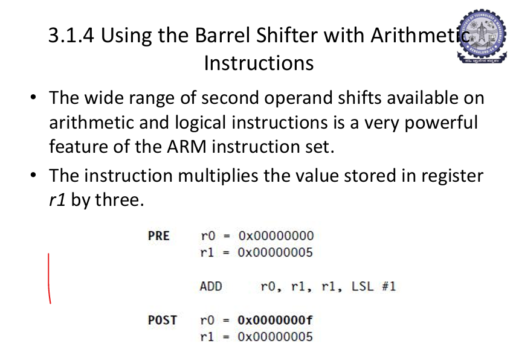


# Using Barrel Shifter with Arithmetic Instructions – Detailed Notes

---

## 🔹 1. Introduction

The barrel shifter in ARM is a hardware unit that allows the second operand of a data processing instruction to be shifted or rotated before it is used by the ALU.

This feature enables ARM to perform **shift and arithmetic operations in a single instruction**, making it very powerful and efficient.

---

## 🔹 2. Basic Concept

In a normal arithmetic instruction:

```asm
ADD R0, R1, R2
```

Meaning:

```asm
R0 = R1 + R2
```

---

With barrel shifter:

```asm
ADD R0, R1, R2, LSL #1
```

Meaning:

```asm
R0 = R1 + (R2 << 1)
```

👉 The second operand (R2) is shifted before addition.

---

## 🔹 3. Multiplication using Barrel Shifter

ARM does not always require a multiplication instruction.

Instead, multiplication by constants can be performed using **shift and add operations**.

---

### 🔥 Example: Multiply by 3

We know:

```text
3 × x = x + 2x
```

And:

```text
2x = x << 1
```

So:

```asm
ADD R0, R1, R1, LSL #1
```

Meaning:

```asm
R0 = R1 + (R1 << 1)
```

👉 Result:

```text
R0 = 3 × R1
```

---

### 🔥 Example: Multiply by 5

```text
5 × x = x + 4x
4x = x << 2
```

```asm
ADD R0, R1, R1, LSL #2
```

---

### 🔥 Example: Multiply by 9

```text
9 × x = x + 8x
8x = x << 3
```

```asm
ADD R0, R1, R1, LSL #3
```

---

### 🔥 Example: Multiply by 7

```text
7 × x = 8x - x
8x = x << 3
```

```asm
RSB R0, R1, R1, LSL #3
```

Meaning:

```asm
R0 = (R1 << 3) - R1
```

---

## 🔹 4. General Technique

To multiply a number using barrel shifter:

### Method 1 (Addition)

```text
k × x = x + (x << n)
```

---

### Method 2 (Subtraction)

```text
k × x = (x << n) - x
```

---

## 🔹 5. Division using Barrel Shifter

Division by powers of 2 can be done using shift right operations.

### Example:

```asm
MOV R0, R1, LSR #1
```

Meaning:

```asm
R0 = R1 / 2
```

---

## 🔹 6. Using Barrel Shifter with Other Arithmetic Instructions

---

### Example 1: ADD with Shift

```asm
ADD R0, R1, R2, LSL #2
```

```asm
R0 = R1 + (R2 × 4)
```

---

### Example 2: SUB with Shift

```asm
SUB R0, R1, R2, LSR #1
```

```asm
R0 = R1 - (R2 / 2)
```

---

### Example 3: AND with Shift

```asm
AND R0, R1, R2, LSR #1
```

```asm
R0 = R1 AND (R2 >> 1)
```

---

## 🔹 7. Advantages

* Combines multiple operations in one instruction
* Reduces instruction count
* Improves execution speed
* Efficient for multiplication/division by constants

---

## 🔹 8. Key Points for Exam

* Barrel shifter modifies Operand2 before ALU operation
* Used with arithmetic and logical instructions
* Enables multiplication using shift operations
* Reduces number of instructions

---

## 🔹 9. Exam-Ready Summary

The barrel shifter in ARM allows the second operand of arithmetic instructions to be shifted before use. This enables efficient implementation of multiplication and division by constants using shift operations. For example, multiplication by 3 can be performed using ADD R0, R1, R1, LSL #1. This feature reduces instruction count and improves performance.

---


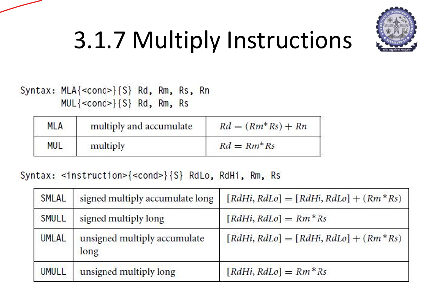

# ARM Multiply Instructions – Detailed Exam Notes

---

## 🔹 1. Introduction

Multiply instructions in ARM are used to perform multiplication of values stored in registers.

Unlike simple arithmetic instructions, ARM provides different types of multiply instructions for:

* Basic multiplication
* Multiply with accumulation
* Signed multiplication
* Unsigned multiplication
* Long (64-bit) multiplication

---

## 🔹 2. Basic Multiply Instructions

---

## ✅ 2.1 MUL – Multiply

### 📌 Syntax

```asm
MUL{cond}{S} Rd, Rm, Rs
```

### 📌 Operation

```asm
Rd = Rm * Rs
```

### 📌 Explanation

* Multiplies values in Rm and Rs
* Stores result in Rd
* Result is 32-bit

### 📌 Example

```asm
MOV R1, #5
MOV R2, #4
MUL R0, R1, R2
```

Result:

```asm
R0 = 20
```

---

## ✅ 2.2 MLA – Multiply Accumulate

### 📌 Syntax

```asm
MLA{cond}{S} Rd, Rm, Rs, Rn
```

### 📌 Operation

```asm
Rd = (Rm * Rs) + Rn
```

### 📌 Explanation

* Multiplies Rm and Rs
* Adds Rn to the result
* Stores final result in Rd

### 📌 Example

```asm
MOV R1, #5
MOV R2, #4
MOV R3, #2
MLA R0, R1, R2, R3
```

Result:

```asm
R0 = (5 * 4) + 2 = 22
```

---

## 🔹 3. Long Multiply Instructions (64-bit Result)

When multiplication result exceeds 32 bits, ARM uses **long multiply instructions**.

These store result in **two registers**:

* RdLo → lower 32 bits
* RdHi → higher 32 bits

---

## 🔸 General Syntax

```asm
<instruction>{cond}{S} RdLo, RdHi, Rm, Rs
```

---

## 🔹 4. Types of Long Multiply Instructions

---

## ✅ 4.1 UMULL – Unsigned Multiply Long

### 📌 Operation

```asm
[RdHi, RdLo] = Rm * Rs
```

### 📌 Explanation

* Performs unsigned multiplication
* Stores 64-bit result

---

## ✅ 4.2 UMLAL – Unsigned Multiply Accumulate Long

### 📌 Operation

```asm
[RdHi, RdLo] = [RdHi, RdLo] + (Rm * Rs)
```

### 📌 Explanation

* Multiplies Rm and Rs
* Adds to existing 64-bit value

---

## ✅ 4.3 SMULL – Signed Multiply Long

### 📌 Operation

```asm
[RdHi, RdLo] = Rm * Rs
```

### 📌 Explanation

* Performs signed multiplication
* Handles negative numbers

---

## ✅ 4.4 SMLAL – Signed Multiply Accumulate Long

### 📌 Operation

```asm
[RdHi, RdLo] = [RdHi, RdLo] + (Rm * Rs)
```

### 📌 Explanation

* Signed multiplication with accumulation

---

## 🔹 5. Signed vs Unsigned

| Type     | Meaning                                  |
| -------- | ---------------------------------------- |
| Signed   | Works with positive and negative numbers |
| Unsigned | Works only with positive numbers         |

---

## 🔹 6. S Suffix (Important)

If instruction has `S`:

* Condition flags are updated

Example:

```asm
MULS R0, R1, R2
```

---

## 🔹 7. Condition Field

Instructions can be conditional:

```asm
MULEQ R0, R1, R2
```

Executed only if condition is true.

---

## 🔹 8. Key Points for Exam

* MUL performs simple multiplication
* MLA performs multiply and accumulate
* Long instructions produce 64-bit result
* Signed and unsigned versions exist
* Results stored in registers only

---

## 🔹 9. Difference Between Instructions

| Instruction | Operation                           |
| ----------- | ----------------------------------- |
| MUL         | Rd = Rm * Rs                        |
| MLA         | Rd = (Rm * Rs) + Rn                 |
| UMULL       | 64-bit unsigned multiplication      |
| UMLAL       | 64-bit unsigned multiply accumulate |
| SMULL       | 64-bit signed multiplication        |
| SMLAL       | 64-bit signed multiply accumulate   |

---

## 🔹 10. Exam-Ready Summary

ARM multiply instructions are used to perform multiplication operations on register values. MUL performs simple multiplication, while MLA performs multiply and accumulate. For large results, long multiply instructions such as UMULL, UMLAL, SMULL, and SMLAL are used, which store 64-bit results in two registers. Both signed and unsigned versions are available, and instructions can optionally update condition flags.

---

# ARM State – Detailed Exam Notes

---

## 🔹 1. Definition

ARM State is the **normal execution mode** of an ARM processor in which the CPU executes **32-bit instructions**.

---

## 🔹 2. Instruction Size

* Each instruction is **32 bits (4 bytes)**
* Fixed-length instruction format

### Example:

```asm
ADD R0, R1, R2
```

---

## 🔹 3. Key Features

### ✅ 1. Full Instruction Set

* Supports all arithmetic, logical, and data processing instructions
* No restrictions on operations

---

### ✅ 2. Conditional Execution (Very Important)

* Almost every instruction can be executed conditionally

### Example:

```asm
ADDEQ R0, R1, R2
```

Meaning: Execute ADD only if condition is true

---

### ✅ 3. High Performance

* Fewer instructions needed for complex operations
* Faster execution compared to Thumb

---

### ✅ 4. Full Register Access

* Uses all registers: R0 – R15

---

### ✅ 5. Barrel Shifter Support

Allows shift operations within instructions:

```asm
ADD R0, R1, R2, LSL #2
```

Meaning:

```asm
R0 = R1 + (R2 × 4)
```

---

## 🔹 4. Instruction Format (Concept)

ARM instructions include fields such as:

* Condition field
* Opcode
* Source and destination registers
* Operand2 (can be shifted)

---

## 🔹 5. Advantages

* High execution speed
* Flexible and powerful instructions
* Efficient handling of complex operations

---

## 🔹 6. Disadvantages

* Larger code size (each instruction = 4 bytes)
* More memory consumption compared to Thumb state

---

## 🔹 7. Control of ARM State

ARM state is controlled by the **T-bit (Thumb bit)** in the CPSR register.

| T-bit | Mode        |
| ----- | ----------- |
| 0     | ARM State   |
| 1     | Thumb State |

---

## 🔹 8. When to Use ARM State

* Performance-critical applications
* Complex computations
* Real-time systems

---

## 🔹 9. Example Execution

```asm
MOV R1, #5
MOV R2, #10
ADD R0, R1, R2
```

Each instruction is 32-bit and executed sequentially.

---

## 🔹 10. Exam-Ready Summary

ARM state is the normal execution mode of an ARM processor in which 32-bit instructions are executed. It provides a full instruction set, supports conditional execution, allows use of all registers, and enables efficient operations using features like the barrel shifter. It offers high performance but results in larger code size.

---
# Thumb State – Detailed Exam Notes

---

## 🔹 1. Definition

Thumb State is a mode of ARM processor execution in which the CPU executes **16-bit compressed instructions** instead of 32-bit ARM instructions.

It is designed to **reduce code size** and improve memory efficiency.

---

## 🔹 2. Instruction Size

* Each instruction is **16 bits (2 bytes)**
* Half the size of ARM instructions

### Example:

```asm
ADD R0, R1
```

---

## 🔹 3. Key Features

### ✅ 1. Reduced Instruction Set

* Supports fewer instructions compared to ARM
* Simplified operations

---

### ✅ 2. Smaller Code Size

* Instructions take less memory
* Programs are more compact

---

### ✅ 3. Limited Conditional Execution

* Does not support full conditional execution like ARM
* Uses **IT (If-Then)** instruction for conditions

### Example:

```asm
IT EQ
ADDEQ R0, R1
```

---

### ✅ 4. Limited Register Access

* Mainly uses registers **R0–R7**
* Some instructions can access higher registers but limited

---

### ✅ 5. Lower Performance for Complex Tasks

* Requires more instructions for complex operations
* Slightly slower than ARM for heavy computation

---

## 🔹 4. Advantages

* Reduces memory usage
* Improves cache utilization
* Suitable for embedded systems
* Efficient for low-power devices

---

## 🔹 5. Disadvantages

* Limited instruction set
* Reduced flexibility
* More instructions required for complex operations

---

## 🔹 6. Control of Thumb State

Thumb state is controlled by the **T-bit (Thumb bit)** in CPSR register.

| T-bit | Mode        |
| ----- | ----------- |
| 0     | ARM State   |
| 1     | Thumb State |

---

## 🔹 7. Switching to Thumb State

Switching is done using branch instructions such as:

```asm
BX Rn
```

If LSB of address = 1 → Thumb state

---

## 🔹 8. When to Use Thumb State

* Memory-constrained systems
* Embedded devices
* Applications where code size matters more than speed

---

## 🔹 9. Example Execution

```asm
MOV R1, #5
ADD R0, R1
```

Each instruction is 16-bit and compact.

---

## 🔹 10. ARM vs Thumb (Quick View)

| Feature               | ARM State | Thumb State  |
| --------------------- | --------- | ------------ |
| Instruction size      | 32-bit    | 16-bit       |
| Performance           | High      | Moderate     |
| Code size             | Large     | Small        |
| Registers             | R0–R15    | Mostly R0–R7 |
| Conditional execution | Full      | Limited      |

---

## 🔹 11. Exam-Ready Summary

Thumb state is a compressed instruction execution mode in ARM processors where instructions are 16 bits long. It reduces code size and memory usage but has a limited instruction set and lower flexibility compared to ARM state. It is mainly used in embedded systems where memory efficiency is important.

---

# ARM Code vs Thumb Code – Detailed Comparison (Exam Ready Notes)

---

## 🔹 1. Introduction

ARM processors support two types of instruction sets:

* **ARM Code** (32-bit instructions)
* **Thumb Code** (16-bit compressed instructions)

These two modes are used to balance **performance** and **memory efficiency**.

---

## 🔹 2. Basic Definition

### ✅ ARM Code

ARM code refers to instructions executed in **ARM state**, where each instruction is **32 bits (4 bytes)** long.

---

### ✅ Thumb Code

Thumb code refers to instructions executed in **Thumb state**, where each instruction is typically **16 bits (2 bytes)** long.

---

## 🔹 3. Detailed Comparison Table

| Feature               | ARM Code                           | Thumb Code                       |
| --------------------- | ---------------------------------- | -------------------------------- |
| Instruction Size      | 32-bit (4 bytes)                   | 16-bit (2 bytes)                 |
| Code Density          | Low (larger programs)              | High (compact programs)          |
| Memory Usage          | High                               | Low                              |
| Performance           | High for complex operations        | Slightly lower for complex tasks |
| Instruction Set       | Full instruction set               | Reduced/compact instruction set  |
| Register Access       | Full access (R0–R15)               | Mostly R0–R7 (limited)           |
| Conditional Execution | Almost all instructions support it | Limited (uses IT instruction)    |
| Flexibility           | High                               | Moderate                         |
| Power Consumption     | Higher                             | Lower                            |
| Use Case              | Performance-critical tasks         | Memory-constrained systems       |

---

## 🔹 4. Example of ARM Code

```asm
MOV R1, #5
MOV R2, #10
ADD R0, R1, R2
```

### 📌 Explanation:

* Each instruction is 32-bit
* Uses full instruction set
* Executes faster for complex logic

---

## 🔹 5. Example of Thumb Code

```asm
MOV R1, #5
ADD R0, R1
```

### 📌 Explanation:

* Instructions are 16-bit
* Simpler format
* More compact code

---

## 🔹 6. Key Concept (VERY IMPORTANT)

* ARM Code → Optimized for **speed and performance**
* Thumb Code → Optimized for **memory and size**

---

## 🔹 7. When to Use Which?

### Use ARM Code when:

* High performance is required
* Complex calculations are needed

### Use Thumb Code when:

* Memory is limited
* Code size needs to be small

---

## 🔹 8. Exam-Ready Summary

ARM code uses 32-bit instructions and provides high performance with a full instruction set, while Thumb code uses 16-bit compressed instructions to reduce code size and memory usage. ARM code is preferred for speed, whereas Thumb code is preferred for memory efficiency.

---

# ARM Code vs Thumb Code – Detailed Comparison (Exam Ready Notes)

---

## 🔹 1. Introduction

ARM processors support two types of instruction sets:

* **ARM Code** (32-bit instructions)
* **Thumb Code** (16-bit compressed instructions)

These two modes are used to balance **performance** and **memory efficiency**.

---

## 🔹 2. Basic Definition

### ✅ ARM Code

ARM code refers to instructions executed in **ARM state**, where each instruction is **32 bits (4 bytes)** long.

---

### ✅ Thumb Code

Thumb code refers to instructions executed in **Thumb state**, where each instruction is typically **16 bits (2 bytes)** long.

---

## 🔹 3. Detailed Comparison Table

| Feature               | ARM Code                           | Thumb Code                       |
| --------------------- | ---------------------------------- | -------------------------------- |
| Instruction Size      | 32-bit (4 bytes)                   | 16-bit (2 bytes)                 |
| Code Density          | Low (larger programs)              | High (compact programs)          |
| Memory Usage          | High                               | Low                              |
| Performance           | High for complex operations        | Slightly lower for complex tasks |
| Instruction Set       | Full instruction set               | Reduced/compact instruction set  |
| Register Access       | Full access (R0–R15)               | Mostly R0–R7 (limited)           |
| Conditional Execution | Almost all instructions support it | Limited (uses IT instruction)    |
| Flexibility           | High                               | Moderate                         |
| Power Consumption     | Higher                             | Lower                            |
| Use Case              | Performance-critical tasks         | Memory-constrained systems       |

---

## 🔹 4. Example of ARM Code

```asm
MOV R1, #5
MOV R2, #10
ADD R0, R1, R2
```

### 📌 Explanation:

* Each instruction is 32-bit
* Uses full instruction set
* Executes faster for complex logic

---

## 🔹 5. Example of Thumb Code

```asm
MOV R1, #5
ADD R0, R1
```

### 📌 Explanation:

* Instructions are 16-bit
* Simpler format
* More compact code

---

## 🔹 6. Key Concept (VERY IMPORTANT)

* ARM Code → Optimized for **speed and performance**
* Thumb Code → Optimized for **memory and size**

---

## 🔹 7. When to Use Which?

### Use ARM Code when:

* High performance is required
* Complex calculations are needed

### Use Thumb Code when:

* Memory is limited
* Code size needs to be small

---

## 🔹 8. Exam-Ready Summary

ARM code uses 32-bit instructions and provides high performance with a full instruction set, while Thumb code uses 16-bit compressed instructions to reduce code size and memory usage. ARM code is preferred for speed, whereas Thumb code is preferred for memory efficiency.

---

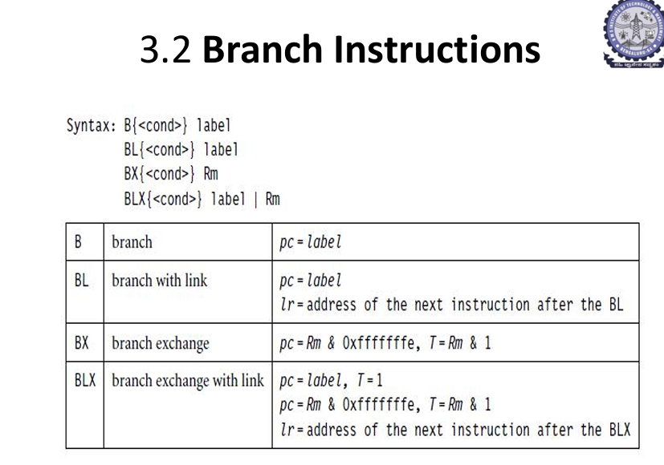

# ARM Branch Instructions – Detailed Exam Notes

---

## 🔹 1. Introduction

Branch instructions in ARM are used to **change the flow of program execution**.

Normally, instructions execute sequentially, but branch instructions allow the processor to:

* Jump to another location
* Implement loops
* Perform conditional execution
* Call and return from functions

---

## 🔹 2. Types of Branch Instructions

ARM provides the following branch instructions:

* **B** → Branch
* **BL** → Branch with Link
* **BX** → Branch and Exchange
* **BLX** → Branch with Link and Exchange

---

## 🔹 3. B – Branch Instruction

### 📌 Syntax

```asm
B{cond} label
```

### 📌 Operation

```asm
PC = label
```

### 📌 Explanation

* Transfers control to a specified label
* Used for unconditional or conditional jumps

### 📌 Example

```asm
B LOOP
```

---

## 🔹 4. BL – Branch with Link

### 📌 Syntax

```asm
BL{cond} label
```

### 📌 Operation

```asm
PC = label
LR = address of next instruction
```

### 📌 Explanation

* Used for **function calls**
* Saves return address in **Link Register (LR = R14)**

### 📌 Example

```asm
BL FUNCTION
```

---

## 🔹 5. BX – Branch and Exchange

### 📌 Syntax

```asm
BX{cond} Rm
```

### 📌 Operation

```asm
PC = Rm & 0xFFFFFFFE
T = Rm & 1
```

### 📌 Explanation

* Branches to address stored in register Rm
* Switches between ARM and Thumb state

### 📌 Key Concept

| LSB of Address | Mode        |
| -------------- | ----------- |
| 0              | ARM State   |
| 1              | Thumb State |

---

## 🔹 6. BLX – Branch with Link and Exchange

### 📌 Syntax

```asm
BLX{cond} label
BLX{cond} Rm
```

### 📌 Operation

#### Case 1: Immediate label

```asm
PC = label
T = 1
LR = return address
```

#### Case 2: Register

```asm
PC = Rm & 0xFFFFFFFE
T = Rm & 1
LR = return address
```

### 📌 Explanation

* Combines **function call + state switching**
* Used for interworking between ARM and Thumb

---

## 🔹 7. Conditional Branching

All branch instructions can be conditional using condition codes:

```asm
BEQ label
BNE label
BGT label
BLT label
```

---

## 🔹 8. Summary Table

| Instruction | Function                     | Key Feature                 |
| ----------- | ---------------------------- | --------------------------- |
| B           | Jump                         | Changes PC                  |
| BL          | Function call                | Saves return address in LR  |
| BX          | Branch + state change        | Switches ARM/Thumb          |
| BLX         | Function call + state change | Saves LR and switches state |

---

## 🔹 9. Key Points for Exam

* Branch instructions modify the **Program Counter (PC)**
* BL saves return address in **LR**
* BX and BLX are used for **ARM–Thumb interworking**
* LSB of address determines execution state

---

## 🔹 10. Exam-Ready Summary

Branch instructions in ARM are used to alter program flow by modifying the program counter. B performs simple branching, BL is used for function calls by saving the return address in LR, BX is used for branching with state switching, and BLX combines function calling with state switching.

---
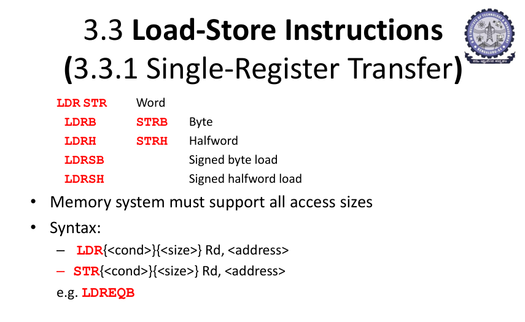
# ARM Load-Store Instructions (Single Register Transfer) – Detailed Exam Notes

---

## 🔹 1. Introduction

ARM follows a **Load/Store architecture**, which means:

👉 Data can only be transferred between **memory and registers** using special instructions:

* **LDR (Load Register)**
* **STR (Store Register)**

Other instructions (ADD, SUB, etc.) **cannot directly access memory**.

---

## 🔹 2. Single Register Transfer

Single register transfer instructions are used to:

* Load data from memory into a register
* Store data from a register into memory

---

## 🔹 3. Types of Load and Store Instructions

### 🔸 1. Word Transfer (32-bit)

| Instruction | Meaning                      |
| ----------- | ---------------------------- |
| LDR         | Load 32-bit word from memory |
| STR         | Store 32-bit word to memory  |

---

### 🔸 2. Byte Transfer (8-bit)

| Instruction | Meaning          |
| ----------- | ---------------- |
| LDRB        | Load 8-bit byte  |
| STRB        | Store 8-bit byte |

---

### 🔸 3. Halfword Transfer (16-bit)

| Instruction | Meaning               |
| ----------- | --------------------- |
| LDRH        | Load 16-bit halfword  |
| STRH        | Store 16-bit halfword |

---

### 🔸 4. Signed Data Transfer (IMPORTANT)

| Instruction | Meaning                       |
| ----------- | ----------------------------- |
| LDRSB       | Load signed byte (8-bit)      |
| LDRSH       | Load signed halfword (16-bit) |

👉 These extend the sign to 32-bit

---

## 🔹 4. Memory Access Sizes

ARM supports different memory sizes:

| Size   | Bits    | Name     |
| ------ | ------- | -------- |
| 8-bit  | 1 byte  | Byte     |
| 16-bit | 2 bytes | Halfword |
| 32-bit | 4 bytes | Word     |

👉 Memory system must support all these sizes.

---

## 🔹 5. General Syntax

### 📌 Load Instruction

```asm
LDR{cond}{size} Rd, address
```

### 📌 Store Instruction

```asm
STR{cond}{size} Rd, address
```

---

## 🔹 6. Addressing Concept

Address is usually given as:

```asm
[Rn]
```

Meaning:

* Rn contains memory address

---

## 🔹 7. Examples

---

### ✅ Example 1: Load Word

```asm
LDR R0, [R1]
```

Meaning:

```asm
R0 = mem32[R1]
```

---

### ✅ Example 2: Store Word

```asm
STR R0, [R1]
```

Meaning:

```asm
mem32[R1] = R0
```

---

### ✅ Example 3: Load Byte

```asm
LDRB R0, [R1]
```

Meaning:

```asm
R0 = mem8[R1]
```

---

### ✅ Example 4: Store Halfword

```asm
STRH R0, [R1]
```

Meaning:

```asm
mem16[R1] = R0
```

---

### ✅ Example 5: Signed Load

```asm
LDRSB R0, [R1]
```

Meaning:

* Load 8-bit value
* Extend sign to 32-bit

---

## 🔹 8. Conditional Execution

Load/store instructions can be conditional:

```asm
LDREQ R0, [R1]
```

👉 Execute only if condition is true

---

## 🔹 9. Key Points for Exam

* LDR loads data from memory to register
* STR stores data from register to memory
* Supports byte, halfword, and word transfers
* Signed loads extend sign to 32-bit
* Memory access only through LDR/STR

---

## 🔹 10. Exam-Ready Summary

Load-store instructions in ARM are used to transfer data between memory and registers. LDR is used to load data from memory into a register, while STR stores data from a register into memory. Different variants such as LDRB, LDRH, and LDRSB allow access to different data sizes. These instructions are essential because ARM does not allow direct memory operations in arithmetic instructions.

---
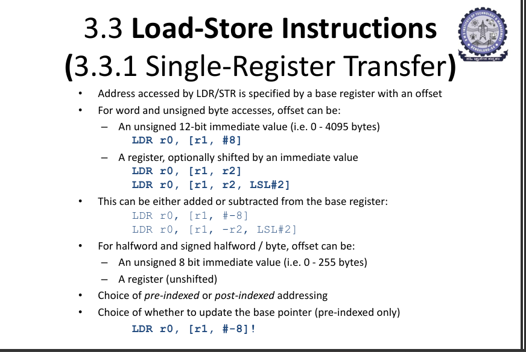
# ARM LDR/STR Addressing Modes – Detailed Exam Notes

---

## 🔹 1. Introduction

In ARM load-store instructions, memory access is done using a **base register + offset**.

👉 General idea:

```asm
Address = Base Register (Rn) ± Offset
```

---

## 🔹 2. Basic Syntax

```asm
LDR Rd, [Rn, offset]
STR Rd, [Rn, offset]
```

* `Rn` → base register (contains address)
* `offset` → value added/subtracted

---

## 🔹 3. Types of Offset

---

## 🔸 3.1 Immediate Offset

### 📌 Syntax

```asm
LDR R0, [R1, #8]
```

### 📌 Meaning

```asm
Address = R1 + 8
R0 = mem[R1 + 8]
```

---

### 📌 Range

* For word access: **0 to 4095 (12-bit unsigned)**

---

## 🔸 3.2 Register Offset

### 📌 Syntax

```asm
LDR R0, [R1, R2]
```

### 📌 Meaning

```asm
Address = R1 + R2
```

---

## 🔸 3.3 Shifted Register Offset (VERY IMPORTANT)

### 📌 Syntax

```asm
LDR R0, [R1, R2, LSL #2]
```

### 📌 Meaning

```asm
Address = R1 + (R2 << 2)
```

👉 Uses **barrel shifter**

---

## 🔹 4. Addition and Subtraction of Offset

Offset can be:

### ✅ Positive

```asm
LDR R0, [R1, #8]
```

### ✅ Negative

```asm
LDR R0, [R1, #-8]
```

### ✅ Register Negative

```asm
LDR R0, [R1, -R2]
```

---

## 🔹 5. Halfword and Byte Offsets

For instructions like:

* LDRH, STRH
* LDRB, STRB

### 📌 Offset Options:

* 8-bit immediate (0–255)
* Register (no shift)

---

## 🔹 6. Addressing Modes (VERY IMPORTANT)

---

## 🔸 6.1 Offset Addressing

### 📌 Syntax

```asm
LDR R0, [R1, #8]
```

### 📌 Meaning

```asm
R0 = mem[R1 + 8]
```

👉 Base register NOT updated

---

## 🔸 6.2 Pre-Indexed Addressing

### 📌 Syntax

```asm
LDR R0, [R1, #8]!
```

### 📌 Meaning

```asm
R1 = R1 + 8
R0 = mem[R1]
```

👉 Base register updated BEFORE access

---

## 🔸 6.3 Post-Indexed Addressing

### 📌 Syntax

```asm
LDR R0, [R1], #8
```

### 📌 Meaning

```asm
R0 = mem[R1]
R1 = R1 + 8
```

👉 Base register updated AFTER access

---

## 🔹 7. Write-back Concept

* `!` indicates **write-back** (update base register)

Example:

```asm
LDR R0, [R1, #8]!
```

---

## 🔹 8. Examples

---

### Example 1

```asm
LDR R0, [R1, #8]
```

👉 Load from address R1 + 8

---

### Example 2

```asm
LDR R0, [R1, R2]
```

👉 Load from address R1 + R2

---

### Example 3

```asm
LDR R0, [R1, R2, LSL #2]
```

👉 Load from address R1 + (R2 × 4)

---

### Example 4

```asm
LDR R0, [R1], #8
```

👉 Load then increment R1

---

## 🔹 9. Key Points for Exam

* Address = base register ± offset
* Offset can be immediate or register
* Register offset can be shifted
* Three addressing modes: offset, pre-indexed, post-indexed
* `!` means write-back

---

## 🔹 10. Exam-Ready Summary

In ARM load-store instructions, memory addressing is performed using a base register and an offset. The offset can be an immediate value, a register, or a shifted register. Addressing modes include offset, pre-indexed, and post-indexed addressing. These modes provide flexibility in accessing memory efficiently.

---
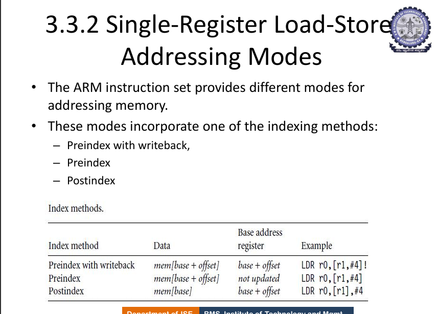

# ARM Single-Register Load–Store Addressing Modes – Indexing Methods (Detailed Exam Notes)

---

## 🔹 1. Introduction

ARM provides flexible ways to compute the **effective memory address** for LDR/STR using a **base register (Rn)** and an **offset**. These are called **addressing (indexing) modes**.

👉 Core idea:

```
Effective Address (EA) = Base (Rn) ± Offset
```

The offset can be an immediate or a register (optionally shifted).

---

## 🔹 2. Indexing Methods (VERY IMPORTANT)

ARM defines three main indexing methods for single-register transfers:

1. **Pre-indexed with write-back**
2. **Pre-indexed (no write-back)**
3. **Post-indexed**

These determine **when** the base register is updated and **what address** is used for the memory access.

---

## 🔸 3. Pre-indexed with Write-back

### 📌 Syntax

```asm
LDR Rd, [Rn, offset]!
STR Rd, [Rn, offset]!
```

### 📌 Operation (Step-by-step)

```
Rn = Rn ± offset      ; update base first (write-back)
EA = Rn               ; use updated base
Rd = mem[EA]          ; for LDR
mem[EA] = Rd          ; for STR
```

### 📌 Key Points

* `!` indicates **write-back**
* Base register **is updated BEFORE** the memory access

### 📌 Example

```asm
LDR R0, [R1, #4]!
```

If `R1 = 1000`:

```
R1 = 1004
R0 = mem[1004]
```

---

## 🔸 4. Pre-indexed (No Write-back)

### 📌 Syntax

```asm
LDR Rd, [Rn, offset]
STR Rd, [Rn, offset]
```

### 📌 Operation

```
EA = Rn ± offset
Rd = mem[EA]          ; for LDR
mem[EA] = Rd          ; for STR
Rn unchanged          ; no write-back
```

### 📌 Key Points

* Base register **is NOT updated**
* Offset is used only to compute address

### 📌 Example

```asm
LDR R0, [R1, #4]
```

If `R1 = 1000`:

```
EA = 1004
R0 = mem[1004]
R1 remains 1000
```

---

## 🔸 5. Post-indexed

### 📌 Syntax

```asm
LDR Rd, [Rn], offset
STR Rd, [Rn], offset
```

### 📌 Operation

```
EA = Rn               ; use original base
Rd = mem[EA]          ; for LDR
mem[EA] = Rd          ; for STR
Rn = Rn ± offset      ; update base AFTER access
```

### 📌 Key Points

* Base register **is updated AFTER** the memory access
* No `!` is used

### 📌 Example

```asm
LDR R0, [R1], #4
```

If `R1 = 1000`:

```
R0 = mem[1000]
R1 = 1004
```

---

## 🔹 6. Offset Forms

The `offset` can be:

### ✅ Immediate

```asm
#4, #-8
```

### ✅ Register

```asm
R2, -R2
```

### ✅ Shifted Register (uses barrel shifter)

```asm
R2, LSL #2
R2, LSR #1
```

---

## 🔹 7. Summary Table (Exam Favorite)

| Method                 | Address Used                 | Base Update  | Example             |
| ---------------------- | ---------------------------- | ------------ | ------------------- |
| Pre-index + write-back | mem[Rn ± off] (after update) | Yes (before) | `LDR R0, [R1, #4]!` |
| Pre-index (no WB)      | mem[Rn ± off]                | No           | `LDR R0, [R1, #4]`  |
| Post-index             | mem[Rn]                      | Yes (after)  | `LDR R0, [R1], #4`  |

---

## 🔹 8. Visual Intuition

Let `R1 = base`, `off = 4`:

* **Pre-index (no WB):**

  * Use `R1 + 4`, keep `R1`
* **Pre-index + WB:**

  * First `R1 = R1 + 4`, then use it
* **Post-index:**

  * Use `R1`, then `R1 = R1 + 4`

---

## 🔹 9. When to Use Which?

* **Pre-index + WB:** walking pointers where base should move immediately
* **Pre-index (no WB):** access nearby memory without changing base
* **Post-index:** iterate through arrays (load/store then advance pointer)

---

## 🔹 10. Common Mistakes (Exam Tips)

* Forgetting that `!` means **write-back before access**
* Confusing pre-index vs post-index order
* Updating base in pre-index without `!` (incorrect)

---

## 🔹 11. Exam-Ready Summary

ARM single-register load/store instructions support three indexing methods: pre-indexed with write-back, pre-indexed without write-back, and post-indexed. These determine whether the base register is updated and whether the update happens before or after the memory access. This flexibility allows efficient array traversal and pointer manipulation.

---


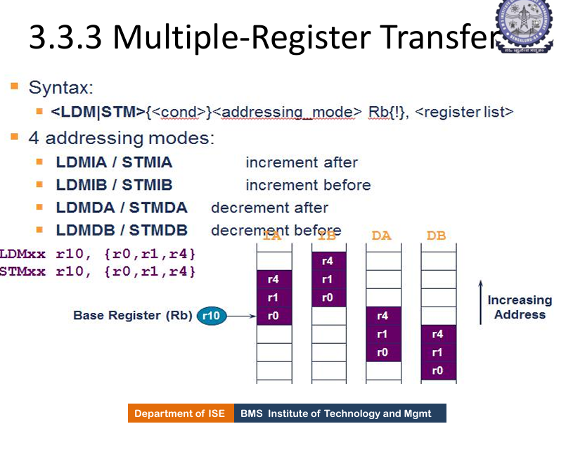
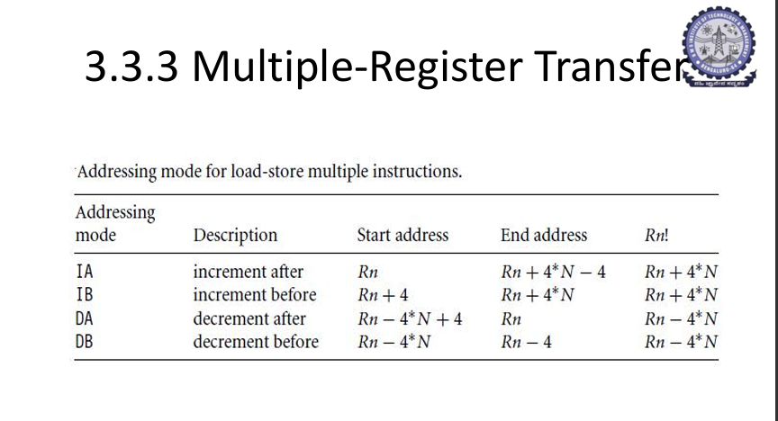


# ARM Stack Operations – Detailed Exam Notes

---

## 🔹 1. Introduction

Stack operations in ARM are performed using **multiple register transfer instructions (LDM and STM)**.

👉 Stack is a special memory structure used for:

* Function calls
* Saving registers
* Temporary data storage

---

## 🔹 2. Basic Stack Operations

### ✅ PUSH (Store to Stack)

* Adds data to stack
* Implemented using **STM (Store Multiple)**

```asm
PUSH {R0, R1}
```

Equivalent:

```asm
STMDB SP!, {R0, R1}
```

---

### ✅ POP (Load from Stack)

* Removes data from stack
* Implemented using **LDM (Load Multiple)**

```asm
POP {R0, R1}
```

Equivalent:

```asm
LDMIA SP!, {R0, R1}
```

---

## 🔹 3. Stack Types (VERY IMPORTANT)

A stack can be classified based on:

---

### 🔸 1. Growth Direction

| Type           | Meaning                                |
| -------------- | -------------------------------------- |
| Ascending (A)  | Stack grows to higher memory addresses |
| Descending (D) | Stack grows to lower memory addresses  |

---

### 🔸 2. Stack Condition

| Type      | Meaning                           |
| --------- | --------------------------------- |
| Full (F)  | SP points to last filled location |
| Empty (E) | SP points to next empty location  |

---

## 🔹 4. Types of Stacks

| Stack Type | Full Form        |
| ---------- | ---------------- |
| FA         | Full Ascending   |
| FD         | Full Descending  |
| EA         | Empty Ascending  |
| ED         | Empty Descending |

---

## 🔹 5. Addressing Modes for Stack (VERY IMPORTANT)

| Mode | Description      | POP (LDM)     | PUSH (STM)    |
| ---- | ---------------- | ------------- | ------------- |
| FA   | Full Ascending   | LDMFA / LDMDA | STMFA / STMIB |
| FD   | Full Descending  | LDMFD / LDMIA | STMFD / STMDB |
| EA   | Empty Ascending  | LDMEA / LDMDB | STMEA / STMIA |
| ED   | Empty Descending | LDMED / LDMIB | STMED / STMDA |

---

## 🔹 6. Most Common Stack Used

👉 **Full Descending (FD)** is most commonly used in ARM

So:

```asm
PUSH = STMDB SP!
POP  = LDMIA SP!
```

---

## 🔹 7. Example (Step-by-Step)

Assume:

```asm
SP = 0x80018
R0 = 1
R1 = 2
```

### PUSH Operation

```asm
STMDB SP!, {R0, R1}
```

Execution:

| Address | Value |
| ------- | ----- |
| 0x80014 | R1    |
| 0x80018 | R0    |

New SP:

```asm
SP = 0x80014
```

---

### POP Operation

```asm
LDMIA SP!, {R0, R1}
```

Execution:

| Address | Value |
| ------- | ----- |
| 0x80014 | R0    |
| 0x80018 | R1    |

New SP:

```asm
SP = 0x8001C
```

---

## 🔹 8. Key Concepts

* Stack works on **LIFO (Last In First Out)**
* SP (Stack Pointer) is used as base register
* PUSH uses STM
* POP uses LDM

---

## 🔹 9. Key Points for Exam

* Stack can be ascending or descending
* Stack can be full or empty
* 4 stack types: FA, FD, EA, ED
* PUSH = store multiple
* POP = load multiple
* FD stack is most commonly used

---

## 🔹 10. Exam-Ready Summary

Stack operations in ARM are implemented using multiple register transfer instructions. PUSH operations use STM instructions, while POP operations use LDM instructions. Stacks can be classified as ascending or descending and full or empty, resulting in four types: FA, FD, EA, and ED. The most commonly used stack type is full descending.

---

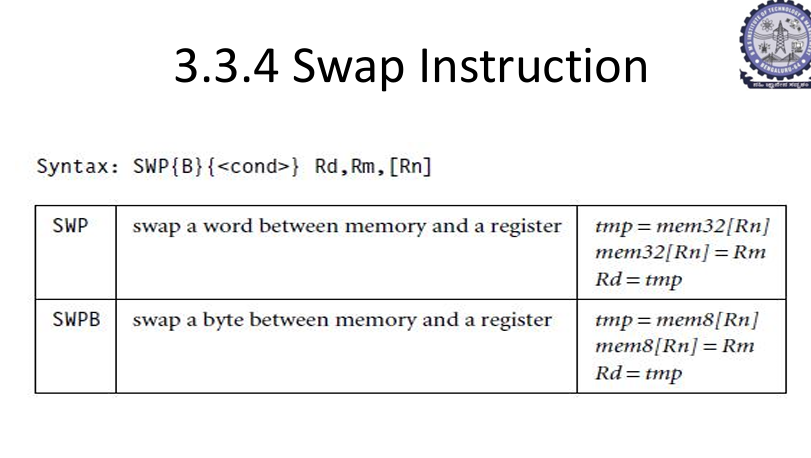
# ARM Swap Instruction (SWP, SWPB) – Detailed Exam Notes

---

## 🔹 1. Introduction

The **Swap instruction** in ARM is used to **exchange data between a register and a memory location** in a single atomic operation.

👉 It is useful for:

* Synchronization
* Mutual exclusion (locks)
* Shared memory access

---

## 🔹 2. Types of Swap Instructions

| Instruction | Meaning            |
| ----------- | ------------------ |
| SWP         | Swap a 32-bit word |
| SWPB        | Swap an 8-bit byte |

---

## 🔹 3. Syntax

```asm
SWP{cond} Rd, Rm, [Rn]
SWPB{cond} Rd, Rm, [Rn]
```

---

## 🔹 4. Operation (VERY IMPORTANT)

### 🔸 For SWP (Word)

```asm
temp = mem32[Rn]
mem32[Rn] = Rm
Rd = temp
```

---

### 🔸 For SWPB (Byte)

```asm
temp = mem8[Rn]
mem8[Rn] = Rm
Rd = temp
```

---

## 🔹 5. Step-by-Step Explanation

Assume:

```asm
R1 = 1000
R2 = 50
mem[1000] = 20
```

Instruction:

```asm
SWP R0, R2, [R1]
```

Execution:

1. Read memory → temp = 20
2. Store R2 → mem[1000] = 50
3. Store temp in Rd → R0 = 20

---

## 🔹 6. Key Concept

👉 SWP performs **read + write in one instruction (atomic operation)**

---

## 🔹 7. Atomic Operation (VERY IMPORTANT)

* No other instruction can interrupt during execution
* Used in **multi-threading and synchronization**

---

## 🔹 8. Difference Between SWP and SWPB

| Feature       | SWP    | SWPB  |
| ------------- | ------ | ----- |
| Data size     | 32-bit | 8-bit |
| Memory access | Word   | Byte  |

---

## 🔹 9. Limitations (IMPORTANT)

* Works only with memory address in register
* Does not support complex addressing modes
* Deprecated in newer ARM architectures (replaced by LDREX/STREX)

---

## 🔹 10. Key Points for Exam

* SWP swaps word between register and memory
* SWPB swaps byte
* Operation is atomic
* Used in synchronization

---

## 🔹 11. Exam-Ready Summary

The SWP instruction in ARM is used to exchange data between a register and a memory location in a single atomic operation. SWP operates on 32-bit words, while SWPB operates on 8-bit bytes. These instructions are useful for synchronization in shared memory systems.

---

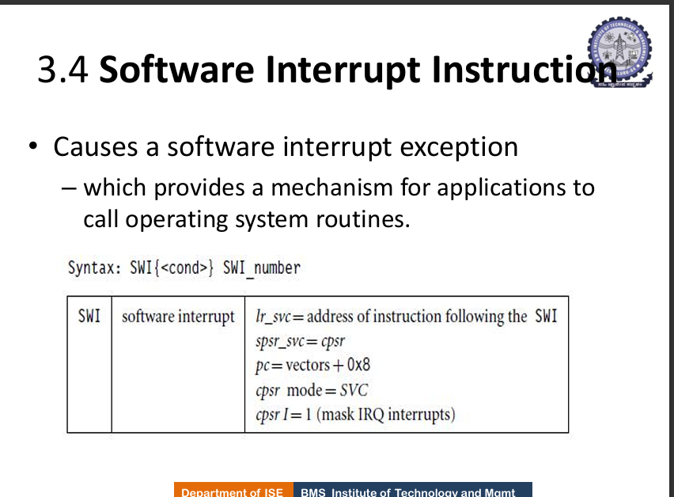
# ARM Software Interrupt (SWI) – Detailed Exam Notes

---

## 🔹 1. Introduction

A **Software Interrupt (SWI)** is an instruction that **intentionally triggers an exception** to transfer control from user code to the **operating system (OS) / supervisor**.

👉 Primary use:

* Calling OS services (system calls)
* Performing privileged operations safely

---

## 🔹 2. Syntax

```asm
SWI{cond} SWI_number
```

* `cond` → optional condition code
* `SWI_number` → immediate value identifying the requested service

---

## 🔹 3. What Happens on SWI (Step-by-Step) 🔥

When SWI executes, the processor performs an **exception entry sequence**:

1. **Save return address**

   ```text
   LR_svc = address of next instruction after SWI
   ```

2. **Save current status**

   ```text
   SPSR_svc = CPSR
   ```

3. **Switch mode to Supervisor (SVC)**

   ```text
   CPSR.mode = SVC
   ```

4. **Disable normal interrupts (IRQ)**

   ```text
   CPSR.I = 1
   ```

5. **Branch to SWI handler**

   ```text
   PC = vector_base + 0x08
   ```

👉 `vector_base + 0x08` is the **SWI vector address** in the exception vector table.

---

## 🔹 4. Exception Vector Table (Concept)

ARM has fixed addresses for exceptions:

| Exception      | Offset   |
| -------------- | -------- |
| Reset          | 0x00     |
| Undefined      | 0x04     |
| **SWI**        | **0x08** |
| Prefetch Abort | 0x0C     |
| Data Abort     | 0x10     |
| IRQ            | 0x18     |
| FIQ            | 0x1C     |

👉 SWI always jumps to **0x08 offset**.

---

## 🔹 5. Role of SWI Number

* The immediate value (`SWI_number`) identifies **which OS service to execute**
* The OS handler reads this value and dispatches the appropriate routine

### Example

```asm
SWI 0x11
```

👉 OS interprets `0x11` as a specific service (e.g., print, exit, etc. depending on system)

---

## 🔹 6. Returning from SWI

After the OS routine completes, control returns to user program using:

```asm
MOVS PC, LR
```

👉 This restores:

* PC (return address)
* CPSR (from SPSR)

---

## 🔹 7. Key Registers Involved

| Register | Purpose               |
| -------- | --------------------- |
| LR_svc   | Stores return address |
| SPSR_svc | Stores old CPSR       |
| CPSR     | Updated to SVC mode   |
| PC       | Jump to handler       |

---

## 🔹 8. Why SWI is Important

* Provides **controlled access to OS**
* Maintains **security (user vs privileged mode)**
* Used in **system calls and APIs**

---

## 🔹 9. Example Flow

```asm
; User program
MOV R0, #5
SWI 0x01
ADD R1, R1, #1
```

Execution:

1. SWI triggers exception
2. Control goes to OS handler
3. OS performs service
4. Returns to next instruction (`ADD`)

---

## 🔹 10. Key Points for Exam

* SWI generates a software interrupt
* Used to call OS routines
* Switches to **Supervisor (SVC) mode**
* Saves return address in **LR_svc**
* Jumps to **vector address 0x08**

---

## 🔹 11. Exam-Ready Summary

The SWI instruction in ARM is used to generate a software interrupt that transfers control to the operating system. It saves the current state, switches the processor to supervisor mode, and branches to the SWI handler at vector address 0x08. It is mainly used to implement system calls.

---

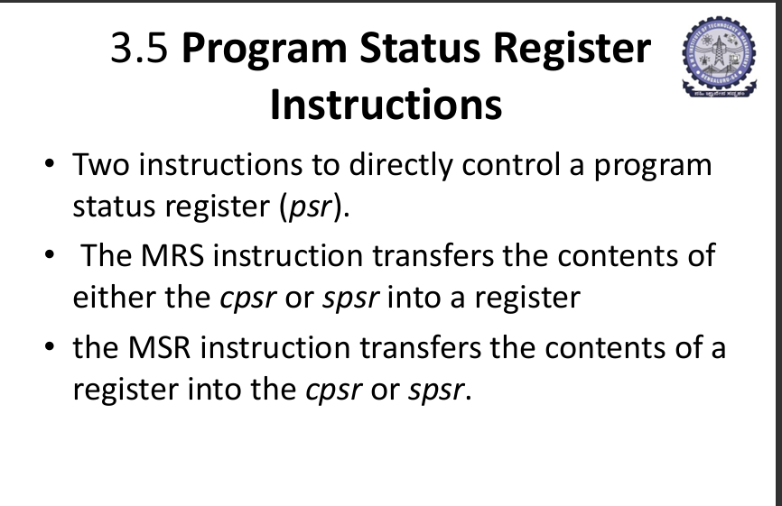

# ARM Program Status Register (PSR) Instructions – Detailed Exam Notes

---

## 🔹 1. Introduction

The **Program Status Register (PSR)** is one of the most important registers in ARM architecture. It stores the **current state of the processor**, including:

* Condition flags
* Execution state (ARM/Thumb)
* Interrupt status
* Processor mode

---

## 🔹 2. Types of PSR

### ✅ 1. CPSR (Current Program Status Register)

* Holds **current processor state**

### ✅ 2. SPSR (Saved Program Status Register)

* Holds **previous CPSR value during exceptions**

👉 Used when returning from interrupts/exceptions

---

## 🔹 3. Structure of CPSR (VERY IMPORTANT 🔥)

CPSR is a 32-bit register divided into fields:

### 📌 Fields

| Bits  | Field     | Meaning           |
| ----- | --------- | ----------------- |
| 31–28 | Flags     | N, Z, C, V        |
| 27–24 | Status    | Reserved / status |
| 23–16 | Extension | Future use        |
| 15–8  | Reserved  | —                 |
| 7     | I         | IRQ disable       |
| 6     | F         | FIQ disable       |
| 5     | T         | Thumb state       |
| 4–0   | Mode      | Processor mode    |

---

## 🔹 4. Condition Flags (NZCV)

| Flag | Meaning         |
| ---- | --------------- |
| N    | Negative result |
| Z    | Zero result     |
| C    | Carry / borrow  |
| V    | Overflow        |

👉 Used for conditional execution

---

## 🔹 5. Control Bits (VERY IMPORTANT)

| Bit  | Meaning                         |
| ---- | ------------------------------- |
| I    | Disable IRQ interrupt           |
| F    | Disable FIQ interrupt           |
| T    | 0 = ARM, 1 = Thumb              |
| Mode | CPU mode (User, SVC, IRQ, etc.) |

---

## 🔹 6. Instructions to Access PSR

ARM provides two instructions:

---

## 🔸 6.1 MRS – Move PSR to Register

### 📌 Syntax

```asm
MRS{cond} Rd, CPSR
MRS{cond} Rd, SPSR
```

### 📌 Operation

```asm
Rd = CPSR / SPSR
```

### 📌 Use

* Read flags
* Check processor state

### 📌 Example

```asm
MRS R0, CPSR
```

---

## 🔸 6.2 MSR – Move Register to PSR

### 📌 Syntax

```asm
MSR{cond} CPSR_<fields>, Rm
MSR{cond} SPSR_<fields>, Rm
MSR{cond} CPSR_<fields>, #immediate
```

---

### 📌 Operation

```asm
PSR[field] = Rm OR immediate
```

---

## 🔹 7. Field Selection (VERY IMPORTANT 🔥)

You **do not overwrite entire PSR always**.

You specify fields:

| Field | Meaning                 |
| ----- | ----------------------- |
| _f    | Flags (NZCV)            |
| _c    | Control (mode, I, F, T) |
| _x    | Extension               |
| _s    | Status                  |

---

### 📌 Example

```asm
MSR CPSR_f, R0
```

👉 Only flags updated

```asm
MSR CPSR_c, R0
```

👉 Control bits updated

---

## 🔹 8. Immediate Write Example

```asm
MSR CPSR_c, #0x80
```

👉 Used to modify interrupt bits etc.

---

## 🔹 9. Example Flow (IMPORTANT)

```asm
MRS R0, CPSR
ORR R0, R0, #0x80   ; set I bit
MSR CPSR_c, R0
```

👉 Disables IRQ interrupt

---

## 🔹 10. Privilege Restriction (VERY IMPORTANT)

* User mode **cannot modify control bits**
* Only privileged modes (SVC, IRQ, etc.) can

---

## 🔹 11. Use Cases

* Interrupt control
* Mode switching
* Reading flags
* Exception handling

---

## 🔹 12. Key Points for Exam

* CPSR = current state
* SPSR = saved state
* MRS reads PSR
* MSR writes PSR
* Fields must be specified (_f, _c etc.)
* Contains NZCV flags and control bits

---

## 🔹 13. Exam-Ready Summary

The Program Status Register (PSR) in ARM contains information about the processor state, including flags, execution mode, and interrupt control bits. The MRS instruction is used to transfer the contents of CPSR or SPSR into a register, while the MSR instruction transfers data from a register or immediate value into selected fields of CPSR or SPSR. These instructions are essential for controlling processor behavior.

---

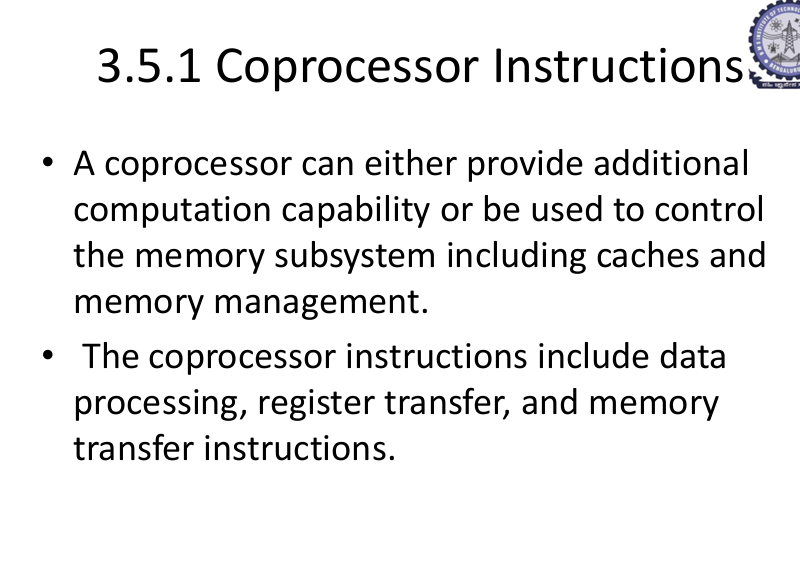
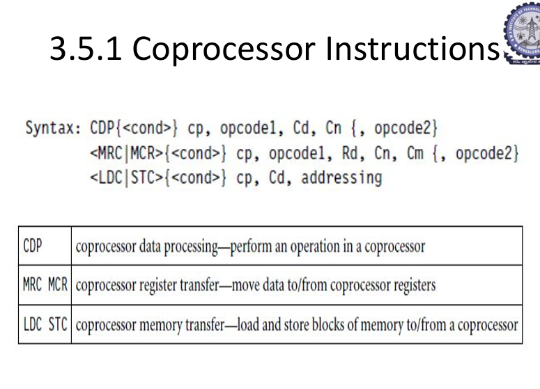

# ARM Coprocessor Instructions – Detailed Exam Notes

---

## 🔹 1. Introduction

A **coprocessor** is a specialized hardware unit that works alongside the ARM CPU to perform specific tasks more efficiently.

👉 Typical roles:

* Floating-point computations (FPU)
* System control (cache, MMU)
* Signal processing

👉 Benefit: Offloads complex tasks from the main CPU → improves performance.

---

## 🔹 2. What Coprocessor Instructions Do

ARM provides instructions to:

* Perform operations inside the coprocessor
* Transfer data between ARM CPU and coprocessor
* Transfer data between memory and coprocessor

---

## 🔹 3. Types of Coprocessor Instructions

### ✅ 1. CDP – Coprocessor Data Processing

### ✅ 2. MRC / MCR – Register Transfer

### ✅ 3. LDC / STC – Memory Transfer

---

## 🔹 4. CDP – Coprocessor Data Processing

### 📌 Syntax

```asm
CDP{cond} cp, opcode1, Cd, Cn {, opcode2}
```

### 📌 Meaning

* Performs an operation **inside the coprocessor**
* Does NOT transfer data to ARM registers directly

### 📌 Components

| Field           | Meaning               |
| --------------- | --------------------- |
| cp              | Coprocessor number    |
| opcode1/opcode2 | Operation selector    |
| Cn, Cd          | Coprocessor registers |

### 📌 Example (Conceptual)

```asm
CDP p1, 0, c1, c2, 0
```

👉 Perform operation using coprocessor registers

---

## 🔹 5. MRC / MCR – Register Transfer

---

### 🔸 MRC – Move from Coprocessor to ARM

### 📌 Syntax

```asm
MRC{cond} cp, opcode1, Rd, Cn, Cm {, opcode2}
```

### 📌 Operation

```asm
Rd = coprocessor register value
```

### 📌 Example

```asm
MRC p15, 0, R0, c1, c0, 0
```

👉 Read system control register into R0

---

### 🔸 MCR – Move from ARM to Coprocessor

### 📌 Syntax

```asm
MCR{cond} cp, opcode1, Rd, Cn, Cm {, opcode2}
```

### 📌 Operation

```asm
coprocessor register = Rd
```

### 📌 Example

```asm
MCR p15, 0, R0, c1, c0, 0
```

👉 Write R0 into system control register

---

## 🔹 6. LDC / STC – Memory Transfer

---

### 🔸 LDC – Load to Coprocessor

### 📌 Syntax

```asm
LDC{cond} cp, Cd, addressing
```

### 📌 Operation

```asm
Load memory data into coprocessor registers
```

---

### 🔸 STC – Store from Coprocessor

### 📌 Syntax

```asm
STC{cond} cp, Cd, addressing
```

### 📌 Operation

```asm
Store coprocessor data into memory
```

---

## 🔹 7. Coprocessor Number (IMPORTANT)

* Identifies which coprocessor is used

Examples:

* p10, p11 → Floating point
* p15 → System control (cache, MMU)

---

## 🔹 8. Key Differences Between Instructions

| Instruction | Purpose                              |
| ----------- | ------------------------------------ |
| CDP         | Perform operation inside coprocessor |
| MRC         | Read from coprocessor to ARM         |
| MCR         | Write from ARM to coprocessor        |
| LDC         | Load from memory to coprocessor      |
| STC         | Store from coprocessor to memory     |

---

## 🔹 9. Use Cases

* Floating point operations
* Cache control
* Memory management unit (MMU)
* System configuration

---

## 🔹 10. Key Points for Exam

* Coprocessor improves performance
* CDP → internal processing
* MRC/MCR → register transfer
* LDC/STC → memory transfer
* Uses coprocessor-specific registers

---

## 🔹 11. Exam-Ready Summary

Coprocessor instructions in ARM are used to perform specialized operations using additional hardware units. CDP performs operations inside the coprocessor, MRC and MCR transfer data between ARM and coprocessor registers, and LDC/STC transfer data between memory and the coprocessor. These instructions enhance performance by offloading complex tasks from the main processor.

---


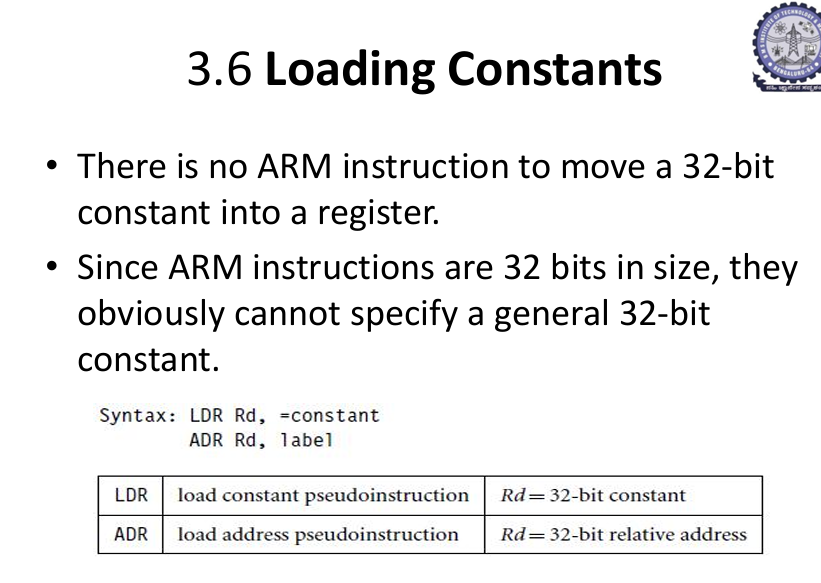

# ARM Loading Constants – Detailed Exam Notes

---

## 🔹 1. Introduction

In ARM, there is **no direct instruction to load a full 32-bit constant** into a register.

👉 Reason:

* ARM instructions are 32-bit in size
* Part of instruction is used for opcode, registers, etc.
* So full 32-bit constant cannot fit directly

---

## 🔹 2. Problem Statement

👉 You cannot do:

```asm
MOV R0, #0x12345678   ; NOT possible directly
```

---

## 🔹 3. Solution: Pseudo Instructions

ARM provides **pseudo-instructions** (handled by assembler):

* **LDR Rd, =constant**
* **ADR Rd, label**

---

## 🔹 4. LDR Pseudo Instruction

### 📌 Syntax

```asm
LDR Rd, =constant
```

### 📌 Meaning

```asm
Rd = 32-bit constant
```

---

### 📌 How it Works (VERY IMPORTANT 🔥)

Assembler converts it into:

👉 Case 1: Small constant

```asm
MOV Rd, #value
```

👉 Case 2: Large constant

```asm
LDR Rd, [PC, offset]
```

👉 Constant is stored in **literal pool (memory)**

---

### 📌 Example

```asm
LDR R0, =0x12345678
```

👉 Internally:

* Constant stored in memory
* Loaded using PC-relative addressing

---

## 🔹 5. Literal Pool (IMPORTANT)

* A memory area where constants are stored
* Located near code
* Accessed using PC-relative addressing

---

## 🔹 6. ADR Instruction

### 📌 Syntax

```asm
ADR Rd, label
```

### 📌 Meaning

```asm
Rd = address of label
```

---

### 📌 Explanation

* Loads address (not value)
* Uses PC-relative calculation

---

### 📌 Example

```asm
ADR R0, LOOP
```

👉 R0 = address of LOOP

---

## 🔹 7. Difference Between LDR and ADR

| Feature     | LDR           | ADR           |
| ----------- | ------------- | ------------- |
| Purpose     | Load constant | Load address  |
| Uses memory | Yes           | No            |
| Range       | Large values  | Limited range |

---

## 🔹 8. Important Points

* LDR = pseudo instruction
* Actual implementation may differ
* Uses PC-relative addressing
* ADR is faster (no memory access)

---

## 🔹 9. Example Flow

```asm
LDR R0, =100
ADR R1, LABEL
```

* R0 gets value 100
* R1 gets address of LABEL

---

## 🔹 10. Key Points for Exam

* No direct 32-bit constant load
* LDR used for constants
* ADR used for addresses
* Literal pool stores constants

---

## 🔹 11. Exam-Ready Summary

ARM does not support direct loading of 32-bit constants into registers. Instead, pseudo-instructions like LDR and ADR are used. LDR loads constants from memory using PC-relative addressing, while ADR loads the address of a label. These techniques allow efficient handling of large constants in ARM programs.

---

## 💬 Viva Answer

ARM uses LDR pseudo-instruction to load constants and ADR to load addresses because it cannot directly encode 32-bit constants in instructions.
